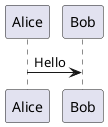

# PlantUML

PlantUML turns plain text into UML diagrams. The advantage is that diagrams live next to code in version control, diff cleanly, and are edited with text tools rather than dragged on a canvas. The cost is that the syntax is its own small language, and several diagram types have very different rules from one another.

## What this skill is for

Use it whenever a diagram would help the conversation: explaining an architecture, documenting an interaction, modeling a state machine, sketching a deployment, walking through a control flow, or annotating a class hierarchy. Don't reach for diagrams when prose would do; PlantUML is most valuable when the *structure* of what's being communicated is the substance.

When the user asks for a diagram, identify which of the nine types fits (see the decision guide below), read the matching reference file in `references/`, and write the diagram. Don't try to remember syntax from memory — the references exist because each diagram type has its own quirks.

## Universal frame

Every PlantUML diagram is bracketed by `@startuml` and `@enduml`. Anything between is the diagram body. Comments begin with `'`. The exact same body can produce a different diagram depending on which elements appear (e.g., `participant` keywords push toward a sequence diagram, `class` toward a class diagram, `[component]` toward a component/deployment diagram).



## Choosing a diagram type — decision guide

The user usually knows roughly what they want but not which UML name maps to it. Use this mapping:

- **Who interacts with the system and how?** → use case diagram (actors and the features they invoke)
- **What messages flow between participants over time?** → sequence diagram (chronological interaction, the most-used UML diagram in practice)
- **What's the static shape of the code?** → class diagram (classes, fields, methods, inheritance, associations)
- **What does a specific snapshot of running data look like?** → object diagram (instances and their current values)
- **What's the control flow of a process?** → activity diagram (steps, branches, loops, parallel forks)
- **What are the deployable pieces and how do they connect?** → component diagram (libraries, services, interfaces)
- **What hardware / runtime nodes does the system live on?** → deployment diagram (nodes, devices, artifacts, the physical or virtual topology)
- **How does this entity change states in response to events?** → state diagram (states, transitions, events, guards)
- **How do signals change over time?** → timing diagram (waveforms, clocks, time-anchored state changes; useful for real-time and embedded systems)

If the user is ambiguous between two diagram types, pick the simpler one and offer the other as an alternative. Don't ask up-front clarifying questions if the choice is obvious from context — a system designer asking to "show how the services talk to each other" wants either a sequence diagram (if timing/order matters) or a component diagram (if it's about which services exist).

## Conventions shared across most diagram types

A few patterns recur enough to be worth knowing without opening any reference file:

- **Arrows.** `->` is solid; `-->` is dashed. More dashes (`---->`) make a longer arrow, which Graphviz uses as a layout hint. Direction can be forced with `-up->`, `-down->`, `-left->`, `-right->` (or shortened to `-u-`, `-d-`, `-l-`, `-r-`). Labels go after `:` — `A -> B : message`.
- **Aliases.** Use `as` to give an element a short alias: `participant "First Class" as A`. Refer to the alias afterwards. This is the cleanest way to handle names with spaces or special characters.
- **Notes.** `note left of X : text` (single line) or `note left of X` / `end note` (multi-line). For floating notes attached by a dotted link, declare with `note as N1` then `X .. N1`.
- **Color.** Background color is `#colorname` (e.g. `#LightBlue`, `#FFAA00`) after most declarations. Arrow color goes inside brackets: `A -[#red]-> B`.
- **Title and header/footer.** `title Some Title`, `header Some Header`, `footer Some Footer`. These work in every diagram type.
- **Direction.** `left to right direction` flips the default top-to-bottom layout. Useful when a diagram is wider than it is tall, especially for use case and deployment diagrams.
- **Skinparam.** `skinparam <name> <value>` changes styling. Heavily-used names: `backgroundColor`, `defaultFontName`, `shadowing`, `roundcorner`, and the per-element families like `skinparam sequence { ... }`.

## What to read before authoring

The references in this skill are the per-diagram syntax guides. Read the one that matches the diagram type you're about to produce, *before* you start writing. Even if you've used PlantUML before, the syntax for activity diagrams (block-structured, `:Action;` and `if/then/else/endif`) is nothing like the syntax for class diagrams (`<|--`, `*--`, `o--`) or timing diagrams (`@100`, `is`, `clock with period`).

Reference files:

- `references/sequence-diagram.md` — chronological messages between participants
- `references/usecase-diagram.md` — actors and the features they invoke
- `references/class-diagram.md` — classes, attributes, methods, relationships
- `references/object-diagram.md` — instances and their current values
- `references/activity-diagram.md` — control flow, branches, loops, parallel
- `references/component-diagram.md` — components, interfaces, ports
- `references/deployment-diagram.md` — nodes, devices, artifacts, topology
- `references/state-diagram.md` — states, transitions, composite and concurrent states
- `references/timing-diagram.md` — signals over time, clocks, anchors

For more obscure features — preprocessing, themes, gantt, mindmap, JSON / YAML rendering — point the user to https://plantuml.com rather than guessing.

## How to deliver a PlantUML diagram to the user

PlantUML source is text the user will paste into a renderer (the official online server, a VS Code plugin, GitHub's native renderer, a CI step). Deliver it as a fenced code block tagged `plantuml`, or as a `.puml` file if it's a substantial deliverable they'll want to keep:

````text

```plantuml
@startuml
...
@enduml
```

````

For short or illustrative diagrams (under ~30 lines), inline is fine. For longer deliverables — a full system architecture, a class diagram of a real codebase — write it as a `.puml` file in the outputs directory so they can download it and feed it to their renderer directly.

If the user has a strong preference (file vs. inline, with or without skinparam styling, ASCII or Unicode arrows), follow it. Otherwise default to: minimal styling, inline for short diagrams, file for long ones, and always include `@startuml` / `@enduml`.

## Practical guidance

A few things that come up repeatedly:

- **Produce diagrams alongside specifications.** When a CMMI specification is created or updated, produce its PlantUML diagram in the same step. Do not defer diagram creation to a separate remediation pass — the skill2rag pilot showed that deferral leads to compliance gaps.
- **Layout is Graphviz's job.** PlantUML hands the diagram to Graphviz for layout, and Graphviz's choices aren't always what the human would have made. Resist the urge to micromanage layout with directional arrows everywhere; trust the default first, and only nudge when the result is genuinely unreadable.
- **One concept per diagram.** A diagram that tries to show structure *and* behavior *and* deployment usually shows none of them well. If the user's request implies more than one, suggest splitting into multiple diagrams.
- **Keep the source readable.** Aliases, blank lines between logical sections, and a consistent ordering (participants first, then interactions; classes first, then relationships) make the source easy to maintain. The text is the artifact; it deserves the same care as code.
- **Real names beat fake ones.** When diagramming the user's actual system, use the actual class / service / actor names from their code. A diagram with `Alice`, `Bob`, `Foo`, `Bar` is fine for teaching syntax but useless for documentation.

*This document is a Configuration Item (CI) under baseline BL-PLANTUML-001.
Changes require Change Control Board approval per `cmmi-glue` Workflow 2.*
