# Activity Diagram

An activity diagram describes a workflow or process: the steps, the order they happen in, and the decisions and parallel paths along the way. PlantUML's *beta* syntax (which is the current default and recommended for all new diagrams) is block-structured: you write actions and control flow keywords in the order they execute, and the layout is generated.

The older, deprecated activity syntax used arrows between named nodes; you'll see it in old documents but should not write new diagrams in it.

## Core syntax

Activity labels are wrapped: `:action text;` — colon at the start, semicolon at the end. They link in declaration order.

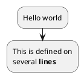

`start` and `stop` (or `end`) mark the start and end nodes:

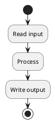

## Conditionals: if / then / else / endif

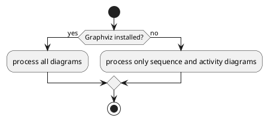

For multiple branches, use `elseif`:

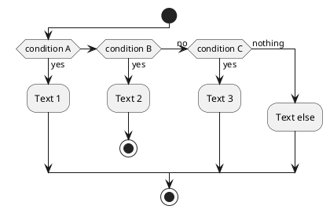

By default elseif chains lay out horizontally; switch to vertical with `!pragma useVerticalIf on` at the top of the diagram.

## Switch / case

For a multi-way branch on a single value, `switch` reads more cleanly than nested `elseif`:

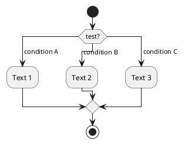

## Loops

`while` / `endwhile`:

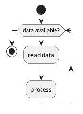

`repeat` / `repeat while` (test at the end of the loop):

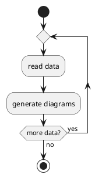

Both loops accept a `backward:Action;` to insert an action in the return path:

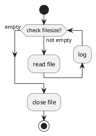

## Parallel flow: fork

`fork` / `fork again` / `end fork` (or `end merge`):

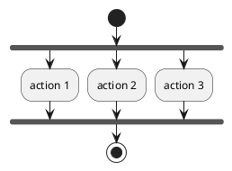

`end fork {and}` or `end fork {or}` adds a UML joinspec label.

## Split (related but distinct from fork)

`split` / `split again` / `end split` is the syntactic cousin of fork. It's useful for showing branching without strict parallelism, or for input/output splits with `[hidden]` arrows:

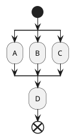

## Ending a branch: stop, end, kill, detach

`stop` and `end` close the diagram normally. Inside a branch, `kill` or `detach` after an action terminates *that branch only* without forcing the whole diagram to stop:

```plantuml
@startuml
if (condition?) then
    :error; <<#pink>>
    kill
endif
:action; <<#palegreen>>
@enduml
```

`break` inside a `repeat` loop exits the loop after the current action.

## Notes

Notes attach to the previous activity with `note left`, `note right`, etc., and can be multi-line:

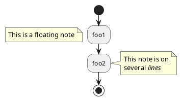

## Colors and styling

`<<#color>>` or `<<#colorname>>` after an action colors it:

```plantuml
@startuml
start
:starting progress;
:reading configuration; <<#HotPink>>
:ending; <<#AAAAAA>>
stop
@enduml
```

Arrows can be styled with `-[#color,style]->` between actions:

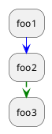

`skinparam ArrowHeadColor none` removes arrowheads entirely (sometimes wanted for flowchart-style diagrams).

## Partitions

`partition Name { ... }` boxes a group of activities, useful for swimlane-like groupings:

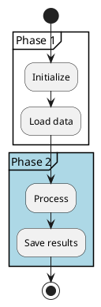

## Common pitfalls

- **Forgetting the trailing `;` on actions.** `:do something` (without `;`) is a syntax error.
- **Mixing old and new syntax.** The legacy syntax (`(*) --> "Initialize"`) doesn't compose with `:action;` blocks. If you find yourself wanting both, you're probably reading old documentation; stick to one.
- **Over-using `fork` for sequential work.** Fork is for genuinely concurrent steps. Sequential conditional logic belongs in `if/elseif/endif`.
- **Trying to draw arrows manually.** Activity-beta syntax is block-structured; you don't draw the arrows, the layout engine does. If you need explicit nodes and arrows, you want either a state diagram (for behavior) or the legacy activity syntax (not recommended).
