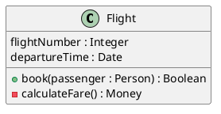
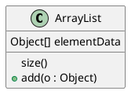
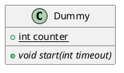
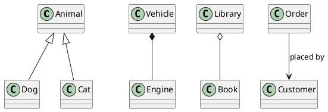
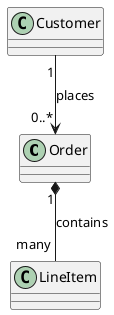
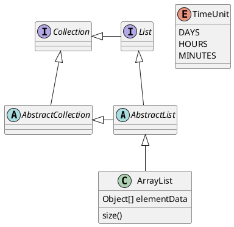
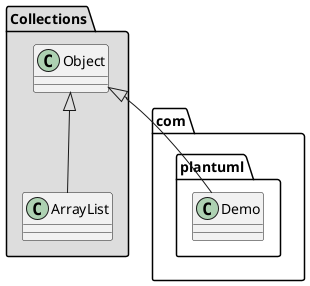
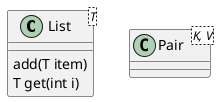
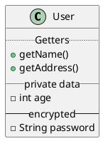

# Class Diagram

A class diagram describes the static structure of a system: classes, their attributes and methods, and the relationships between them. It's the standard UML diagram for documenting code organization and design.

## Core syntax

Declare with `class`, or one of its variants (`interface`, `abstract class`, `enum`, `annotation`, `struct`, `dataclass`, `protocol`, `exception`). Inside braces, list fields and methods. The parser tells fields from methods by the presence of `()`.

Or one-per-line with `:`:

## Visibility markers

A leading character on a field or method sets visibility:

- `-` private
- `#` protected
- `~` package-private
- `+` public

PlantUML renders these as little icons. Turn them off with `skinparam classAttributeIconSize 0` if you want raw symbols.

## Modifiers

`{static}` or `{abstract}` (or `{classifier}`) can precede or follow a field/method:

`abstract class Foo` (or `abstract Foo`) marks the class itself; its name renders in italics.

## Relationships

The relationship arrow encodes the kind of relationship:

| Relationship    | Arrow     | Meaning                                        |
|-----------------|-----------|------------------------------------------------|
| Inheritance     | `<|--`    | One class extends another                      |
| Implementation  | `<|..`    | A class implements an interface                |
| Composition     | `*--`     | Part cannot exist without the whole            |
| Aggregation     | `o--`     | Part can exist independently                   |
| Association     | `-->`     | One uses the other                             |
| Dependency      | `..>`     | A weaker, transient use                        |
| Plain link      | `--`      | Generic association                            |

Replace `--` with `..` for dotted lines. Direction reverses by flipping the arrow: `Class02 --|> Class01` is equivalent to `Class01 <|-- Class02`.

## Labels and cardinality

`:` adds a label after the relationship. Double-quoted strings on either side add cardinality:

## Comprehensive example

## Groupings: packages and namespaces

`package "Name" { ... }` wraps classes in a labeled box. Background color goes after the name: `package "X" #DDDDDD { ... }`. Stereotype the package to change its shape:

- `<<Node>>`
- `<<Rectangle>>`
- `<<Folder>>`
- `<<Frame>>`
- `<<Cloud>>`
- `<<Database>>`

For full nested namespaces with separators in names, use `namespace` instead of `package` — it understands dotted paths.

## Notes

- `note left of ClassName : single-line note`
- Multi-line: `note left of ClassName` ... `end note`
- Floating: `note "text" as N1` then `N1 .. ClassName`
- On a field or method: `note right of A::counter` (note: not compatible with `top`/`bottom` or with the `::` namespace separator)
- On a link: place `note on link` immediately after a relationship line

## Generics

Use `<` and `>` for type parameters:

## Sectioning the class body

Use `--`, `..`, `==`, `__` to draw a separator inside the class. Add a title between two of the same marker:

## Hiding and removing elements

- `hide empty members` collapses classes with no listed fields/methods.
- `hide members` / `show members` toggle visibility globally; combine with stereotypes (`show <<Serializable>> fields`) for fine control.
- `hide @unlinked` / `remove @unlinked` hide or remove classes with no relationships.
- `$tag` on a declaration tags it for later `hide $tag` / `remove $tag` / `restore $tag`.

## Common pitfalls

- **Confusing composition (`*--`) with aggregation (`o--`).** Composition says the part dies with the whole; aggregation says it survives. If you can't articulate the lifetime relationship, use plain association (`--`) instead.
- **Direction confusion on inheritance.** `<|--` points from the child to the parent visually, but reads as "parent has child". `Animal <|-- Dog` is the standard form: parent first, child second.
- **Cluttering with every getter and setter.** A class diagram is a design artifact, not a code dump. Show the methods that matter for the design, not all of them.
- **Forgetting to use `as` for names with spaces.** `class "My Long Class Name" as MLN` then refer to it as `MLN`.
