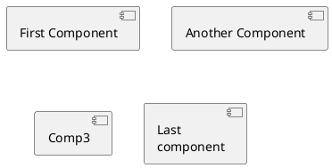
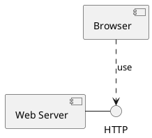
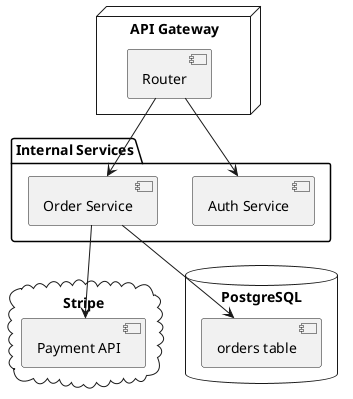
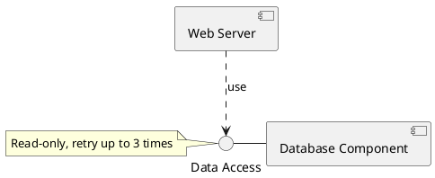
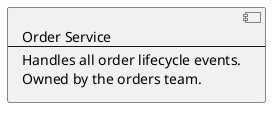
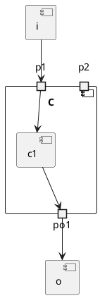

# Component Diagram

A component diagram shows the deployable / replaceable pieces of a system (services, libraries, packages) and the interfaces between them. It's especially useful for documenting microservice architectures and the wiring between modules.

## Core syntax

Components have two forms:

- Brackets: `[Order Service]` — concise for short names
- Keyword: `component "Order Service" as OS` — required when the name has spaces or special characters and you want an alias

Interfaces (the contracts components expose or consume) also have two forms:

- Circle shorthand: `() "Data Access"`
- Keyword: `interface "Data Access" as DA`

## Minimal interaction

The `--` (or its short form `-`) line connects a component to the interface it *provides*. The dotted arrow `..>` connects a component to the interface it *uses*. Combined, they form the classic UML "lollipop and socket" notation: the line ends at a circle, the dotted arrow points to it.

## Groupings

Several keywords box components for organization:

- `package` — generic grouping
- `node` — typically a host or runtime
- `folder` — file-system-style grouping
- `frame` — bounded region
- `cloud` — external / managed
- `database` — data store

## Styles: UML2, UML1, rectangle

PlantUML defaults to UML2 notation, which draws components as rectangles with a small "component" icon in the corner. Two alternatives:

- `skinparam componentStyle uml1` — UML1 notation (component icon attached to the left)
- `skinparam componentStyle rectangle` — plain rectangles, no UML icon

Rectangle style is often clearest for architecture documentation aimed at a non-UML audience.

## Notes

Notes work as everywhere else. Useful pattern: attach a note to an interface to document the contract:

## Long descriptions inside components

Square brackets after a component name let you embed a multi-line description:

The `----` (or `====`, `....`) inside a component description is a separator line, similar to class body separators.

## Ports

A *port* is a typed connection point on a component. Three keywords:

- `port` — generic
- `portin` — input only
- `portout` — output only

Ports are useful when a component has multiple distinct input or output channels that you want named on the diagram.

## Arrow directions

Same as everywhere: `-up->`, `-down->`, `-left->`, `-right->` (or shortened to `-u-`, `-d-`, `-l-`, `-r-`). `left to right direction` flips the default top-to-bottom layout.

## Individual colors

After a component declaration: `component [Web Server] #Yellow`. Or use the inline style notation: `component [Web Server] #pink;line:red;line.bold;text:red`.

## Common pitfalls

- **Confusing required vs. provided interfaces.** The lollipop (circle on a stick) is *provided*; the socket (half-circle) is *required*. Use `[A] - ()` for provided and `[B] ..> ()` for required.
- **Drawing arrows everywhere instead of using interfaces.** Direct component-to-component arrows are fine for sketches but lose the explicit contract information. Use named interfaces when the API matters.
- **Mixing too many groupings.** Pick *one* axis to group on — by team, by deployment unit, by layer — and stick with it. A diagram grouped on three different axes at once is unreadable.
- **Forgetting that the default is UML2.** If your team's other diagrams use UML1 or rectangle style, set the matching `skinparam` early so the documentation feels consistent.
