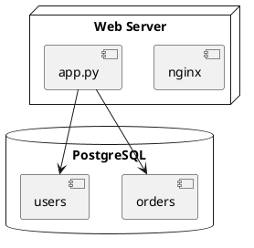
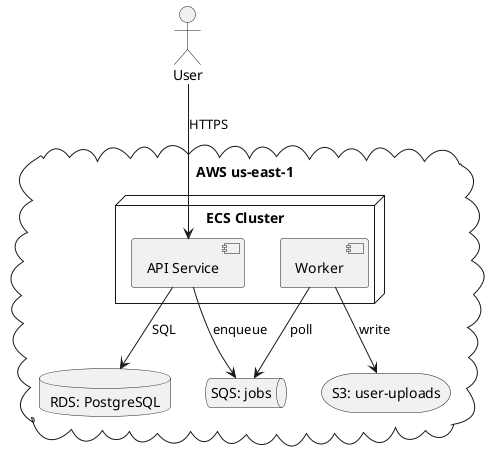
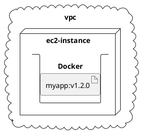
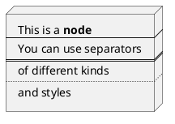

# Deployment Diagram

A deployment diagram shows the physical or virtual topology of a system: which servers, containers, and devices exist, and what software artifacts live on each. PlantUML's deployment diagram syntax is the most permissive of any UML diagram — it accepts a large vocabulary of node shapes and lets you nest them freely.

## Core syntax

Deployment diagrams share most of their element vocabulary with component diagrams, plus several more node-like keywords. The full set of declarable elements:

`action`, `actor`, `agent`, `artifact`, `boundary`, `card`, `circle`, `cloud`, `collections`, `component`, `control`, `database`, `entity`, `file`, `folder`, `frame`, `hexagon`, `interface`, `label`, `node`, `package`, `person`, `process`, `queue`, `rectangle`, `stack`, `storage`, `usecase`.

Each draws with a different shape. `node` is the prototypical "server"; `database` is a cylinder; `cloud` is a cloud shape; `artifact` is the UML symbol for a deployable file; `queue` is a message queue.

## Minimal example

## Realistic topology

## Nesting

Almost every shape is nestable. Common patterns:

- A `cloud` containing `node`s containing `component`s
- A `node` containing `artifact`s
- A `folder` containing `file`s
- A `database` containing `storage` or `artifact`s

## Short forms vs. keyword forms

Four elements have a shorthand:

| Long form              | Short form         |
|------------------------|--------------------|
| `actor actor1`         | `:actor1:`         |
| `component component1` | `[component1]`     |
| `interface interface1` | `() "interface1"`  |
| `usecase usecase1`     | `(usecase1)`       |

Both forms work in deployment diagrams. Use the short form for brevity, the keyword form when you need an alias.

## Long descriptions

Bracketed multi-line text after a declaration adds a description block. The separators `----`, `====`, `....` create lines within the block:

## Links

Standard arrows plus several deployment-specific styles:

- `--`, `..`, `~~`, `==` — line styles (solid, dotted, wavy, double)
- `-->`, `..>`, `==>`, `~~>` — directional variants
- `--*`, `--o`, `--+`, `--#`, `-->>`, `--^` — heads with different semantic decorations
- `-(0` and `0)-` — UML lollipop/socket short forms

Bracketed style applies thickness and per-line styling:

- `-[bold]->`
- `-[dashed]->`
- `-[#red]->`
- `-[thickness=4]->`
- `-[#blue,dashed,thickness=2]->`

Inline-style notation works too: `[A] --> [B] #line:red;line.bold;text:red : label`.

## Diagram orientation

`left to right direction` flips the default top-to-bottom flow. Deployment diagrams often benefit from this since topologies are usually wider than they are tall.

## Common pitfalls

- **Treating it as a component diagram.** A component diagram says *what software pieces exist and how they connect*; a deployment diagram says *where the software runs*. Components and interfaces inside nodes are fine and common; nodes inside components are wrong.
- **Showing too much detail.** A deployment diagram with every file and process is a configuration management database, not a diagram. Pick the level of granularity that matches your audience — typically nodes and the few artifacts that matter.
- **Mixing logical and physical view.** "Auth service" can be either a logical capability (component diagram) or a deployed process on a specific host (deployment diagram). Decide which view you're drawing and keep it consistent.
- **Forgetting to nest.** A deployment diagram of ten unrelated nodes at the top level loses the *topology* information. Group by region, by host, by container — show the containment hierarchy that matches the reality.
