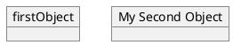
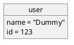
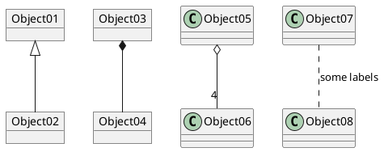
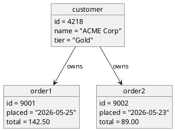
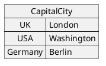
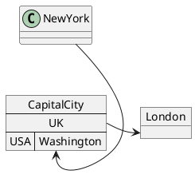

# Object Diagram

An object diagram is a snapshot: which instances exist at a particular moment, what values they hold, and how they relate. It uses almost the same syntax as a class diagram but with `object` instead of `class`, and with concrete values instead of method signatures.

## Core syntax

Declare instances with `object`. Use `as` for an alias when the name has spaces:

## Fields

Use `:` to assign per-line:

Or group inside `{}`:

## Relationships

Same arrow set as class diagrams:

- `<|--` extension (rare in object diagrams since instances don't usually extend each other)
- `*--` composition
- `o--` aggregation
- `-->` dependency
- `..>` weak dependency
- `--` plain link

With cardinality and labels:

## Worked example: a snapshot of state

## Map (associative array)

The `map` keyword renders a key-value table — useful for showing configuration, lookups, or actual data:

Map entries can be referenced from outside the map using `::`:

This is the most distinctive feature of PlantUML's object diagram support: maps are first-class and very useful for showing actual data structures rather than abstract instance shapes.

## Relationship to class diagrams

Object diagrams share most of their feature set with class diagrams:

- `hide` / `show` rules work the same way
- notes (`note left of`, `note as N1`) work the same way
- packages and skinparams work the same way

You can even mix objects and classes in a single diagram when the snapshot includes a type that's worth showing too.

## When to use this instead of a class diagram

Object diagrams are right when:

- You're explaining an example or test case ("what does the state look like after step 3?")
- You're showing the result of a transformation or computation
- The reader needs to see concrete values, not just types

If you're showing the static design of a system, use a class diagram instead.

## Common pitfalls

- **Reusing the same name for an object and its class.** Either prefix instance names (`order1`, `order2`) or use `as` aliases to disambiguate.
- **Showing too many objects.** Object diagrams scale poorly past 10–15 instances. Pick a representative snapshot, not the whole heap.
- **Using inheritance arrows.** `<|--` between objects is technically legal but usually meaningless — instances don't inherit from each other. Stick to associations.
