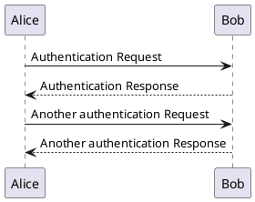
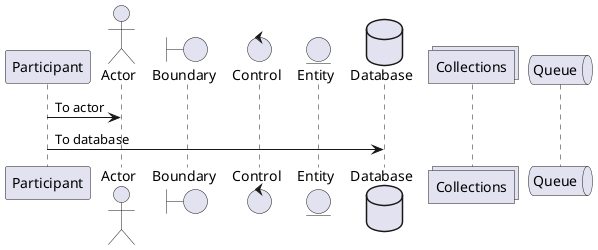
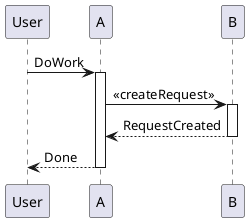
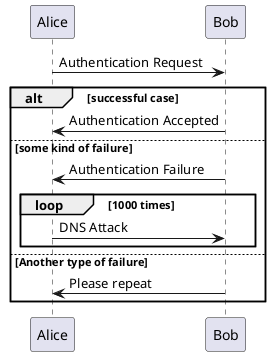
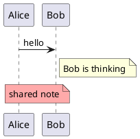
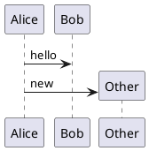
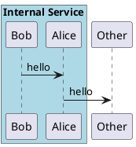
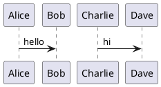

# Sequence Diagram

A sequence diagram shows messages exchanged between participants over time. It's the most-used UML diagram in practice because it captures interaction flow concisely.

## Core syntax

Participants need no declaration — they appear as you mention them in messages. Arrows define messages:

- `A -> B` — solid arrow (synchronous-style)
- `A --> B` — dashed arrow (response, return)
- `A ->> B` — open arrow head
- `A ->x B` — lost message
- `A <-> B` — bidirectional

Labels go after `:` — `A -> B : the message text`.

## Minimal example

## Declared participants

Use `participant` (or one of the shape variants) when you want a specific shape, ordering, or alias:

- `actor` — stick figure
- `boundary` — system boundary
- `control` — controller
- `entity` — entity
- `database` — cylinder
- `collections` — stacked rectangles
- `queue` — queue shape

The order of declaration is the default left-to-right order on screen. Override with `order N` after a declaration.

## Activation and lifelines

A participant is "active" while it's processing a call. Use `activate` / `deactivate`, or the shorthand `++` / `--` immediately after the target:

Shorthand form (same diagram):

`**` after the target creates a participant; `!!` destroys one. The `return` keyword emits a return arrow back to whoever activated the current participant.

## Groups: alt, opt, loop, par, critical, group

These wrap a block of messages with a header. Use `end` to close. Nesting is fine:

Color a group with `alt#Gold #LightBlue Successful case` (frame color, then background color).

## Notes

`note left of X`, `note right of X`, `note over X`, `note over X, Y` (spans), or `note across` (spans every participant).

Multi-line: open with `note left of X` (no colon), close with `end note`.

## Numbering, dividers, delays

- `autonumber` adds incrementing message numbers. `autonumber 10 5` starts at 10, increments by 5. `autonumber stop` / `autonumber resume` to pause and continue.
- `== Section Title ==` is a divider line.
- `...` is a delay; `...5 minutes later...` labels it.
- `|||` adds vertical space; `||50||` adds a 50-pixel gap.
- `== Initialization ==` and similar separate phases visually.

## Self-messages and creation

A participant can message itself: `Alice -> Alice : doing something`. Use `create` before the first message to a participant to emphasize that the message constructs the participant:

## Removing the foot box

By default, participants are drawn at top *and* bottom. `hide footbox` removes the bottom row.

## Boxes around participants

Visually group participants with `box "Label" #color` ... `end box`:

## Parallel and slanted (teoz)

For parallel messages and slanted arrows, enable the `teoz` rendering engine with `!pragma teoz true`. Then use `&` to put a message in parallel with the previous one:

`teoz` also enables nested boxes and several other features that the default engine doesn't support.

## Common pitfalls

- **Forgetting `@startuml` / `@enduml`** is the most common rendering error. The diagram won't render at all without them.
- **Confusing solid (`->`) with dashed (`-->`) arrows.** Convention: solid for the call, dashed for the response. Reversing this confuses readers fluent in UML.
- **Over-styling with skinparam.** A few sequence diagrams need custom colors; most don't. Default styling is fine and matches what every other PlantUML user is reading elsewhere.
- **Trying to control layout.** Sequence diagrams lay out left to right in declaration order. The only knob is `order N` per participant or rearranging declarations. Don't try to force layout with hidden arrows.
