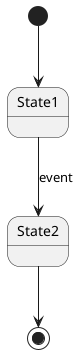
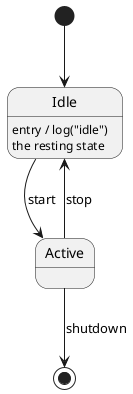
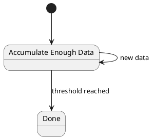
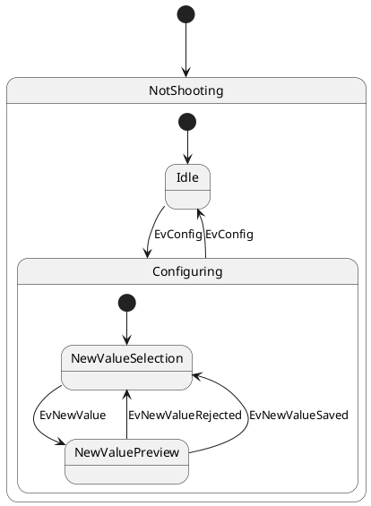
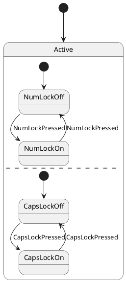
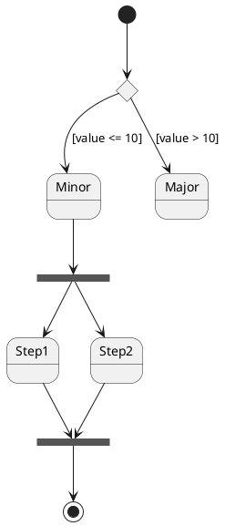
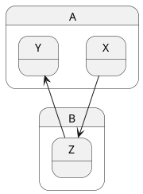
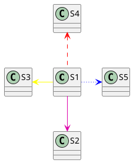
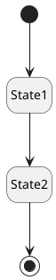

# State Diagram

A state diagram captures how an entity moves between distinct states in response to events. It's the right diagram for any system with a lifecycle (orders, sessions, connections, protocols) or any object whose behavior depends on what mode it's in.

## Core syntax

`[*]` is both the start and the end pseudo-state — it's interpreted as start when it's the source of an arrow, end when it's the target. Arrows are the only relationship; the transition label after `:` carries the event and any actions.

A state may carry a description with `:` (the same line that declares it or a new line):

## Long names and aliases

For state names with spaces or special characters, use `state "..." as ...`:

## Composite states

A state can nest other states. Use `state Name { ... }`:

The inner `[*] --> ...` declares the *initial* sub-state when the composite is entered.

## Concurrent regions

Inside a composite state, `--` or `||` separates parallel regions that run simultaneously:

`--` separates regions vertically; `||` separates them horizontally. Within Active, the NumLock and CapsLock regions are independent — each tracks its own state.

## Pseudo-states (stereotypes)

Use `<<>>` stereotypes to declare special UML pseudo-states:

- `<<start>>` — alternative to `[*]`
- `<<end>>` — alternative to `[*]` as terminal
- `<<choice>>` — conditional branch point
- `<<fork>>` and `<<join>>` — concurrent split / sync
- `<<history>>` — history (re-enter the last sub-state)
- `<<history*>>` — deep history (re-enter the last sub-state at any nesting depth)
- `<<entryPoint>>` and `<<exitPoint>>` — named transition points on a composite state's boundary
- `<<inputPin>>`, `<<outputPin>>`, `<<expansionInput>>`, `<<expansionOutput>>` — UML pin / expansion notation

## Sub-state to sub-state transitions

You can draw arrows between sub-states of different composite states. The path is implicit:

The dotted-name form `state A.X` is equivalent to declaring `X` inside `A`.

## Arrow direction

Forced direction works the same as elsewhere: `-up->`, `-down->`, `-left->`, `-right->`. Default is `-down->` for `-->` and `-right->` for `->`.

## Line color and style

Bracketed style on transitions:

## Notes

Notes work as everywhere: `note left of`, `note right of`, multi-line with `end note`, floating with `note "text" as N1` then `N1 .. SomeState`.

## Hiding empty descriptions

Without a description line, a state renders as a fat box. `hide empty description` collapses descriptionless states to simple boxes, which often looks cleaner:

## Common pitfalls

- **Confusing `[*]` for both start and end.** It's the same symbol but its role is determined by direction. `[*] --> A` is "start to A"; `A --> [*]` is "A to end". Both are common in the same diagram.
- **Forgetting the initial transition inside a composite state.** A composite state needs `[*] --> SubState` to say which sub-state is entered first. Without it, the diagram is ambiguous.
- **Drawing transitions between sub-states across boundaries without realizing you can.** Cross-composite transitions are legal and often the clearest way to express "exit this whole region and enter that one". Don't paper over them with extra exit/entry states.
- **Using state diagrams for sequential workflows.** If the entity has no real "state" — just a sequence of steps — an activity diagram is the right tool. State diagrams are for *modes* that affect *future* behavior.
