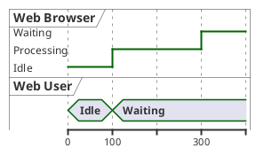
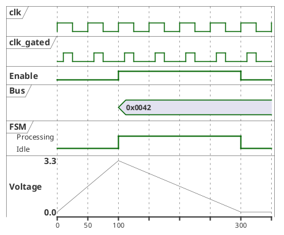
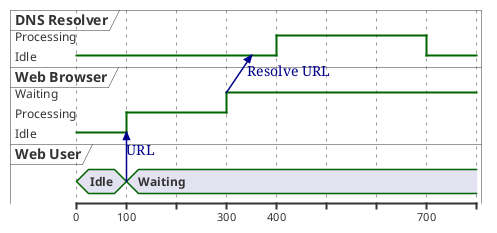
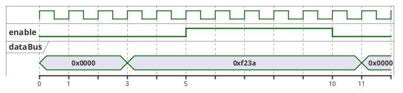
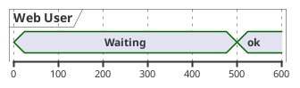
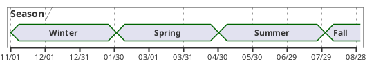
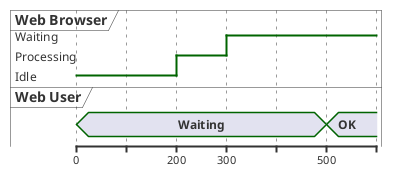
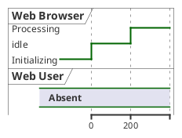
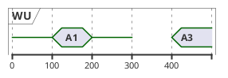

# Timing Diagram

A timing diagram shows how signals or state values change over time. It's the diagram of choice for real-time systems, embedded protocols, and any case where the *time axis* is the primary thing the reader needs to understand. PlantUML supports it as a draft feature — useful and stable for typical cases, but with rougher edges than the older diagram types.

## Core syntax

A timing diagram has two parts:

1. **Declare participants** (each gets one horizontal track), choosing a render style.
2. **Declare time points** with `@`, and state changes with `is`.

Participant types:

| Keyword     | What it draws                                                |
|-------------|--------------------------------------------------------------|
| `analog`    | A continuous line, values linearly interpolated              |
| `binary`    | A signal restricted to two states (high / low)               |
| `clock`     | A repeating square wave with `period` and optional `pulse`   |
| `concise`   | Simplified track for data movement (good for messages)       |
| `rectangle` | Like `concise` but inside a rectangle shape                  |
| `robust`    | A multi-state line; the most versatile general-purpose track |

## Minimal example

The `@N` introduces a time anchor at coordinate `N`. Lines after it apply *at that time*. The diagram interpolates the rest.

## Multiple signal types in one diagram

## Relative time

`@+N` advances by `N` from the previous anchor instead of stating an absolute time:

`WB -> DNS@+50` says the arrow lands on the DNS track 50 ticks after this anchor — useful for showing propagation delay.

## Anchor points (named times)

If the same time matters across multiple state changes, give it a name with `@N as :name`. Then refer to it with `@:name` (and arithmetic like `@:name+5`):

This is the timing-diagram equivalent of using aliases — it makes the timeline edits localized and the relationships explicit.

## Messages between tracks

`A -> B : message` inside a timing diagram draws an arrow between two tracks at the current time point. Use it sparingly — too many arrows clutter a timing diagram.

## Setting the scale

`scale N as P pixels` says "render N ticks as P pixels". Default scale is 1 tick = a small number of pixels, but real timing diagrams often need much wider scaling:

For absolute date / time scales, 1 tick = 1 second:

## Participant-oriented form

Instead of declaring everything chronologically, you can group changes per participant with `@PartName`:

This often reads more naturally when you're thinking about one signal's lifecycle at a time.

## Initial state

Declare a state *before* any `@` anchor to set the initial value:

## Undefined / hidden state

`is {hidden}` or `is {-}` mark a region of the track as no value (a gap). `is {A,B}` marks the value as undefined-between-A-and-B (rendered grey):

Useful for showing "during this window the value is unknown / not observable / both possible".

## Common pitfalls

- **Forgetting to set initial state.** Without a `@0` (or initial declaration) for every track, signals start from an unspecified default which often renders as a confusing gap.
- **Inconsistent scaling.** The same diagram with different `scale` values can look totally different. Pick a scale that makes the most important transitions readable, then leave it.
- **Mixing absolute and relative times.** Once you start using `@+N`, the chain depends on the previous anchor. A single `@N` (absolute) in the middle resets your mental model. Use one style consistently.
- **Trying to draw too many tracks.** Timing diagrams stay readable up to ~6 tracks. Past that, split into separate diagrams (e.g., one per bus or one per subsystem).
- **Treating timing diagrams as sequence diagrams.** Sequence diagrams are about *order* of messages; timing diagrams are about *when, in real time*. If the user's question is "what happens next?", they want a sequence diagram; "when does this signal go high?" wants a timing diagram.
