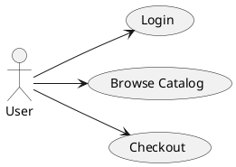
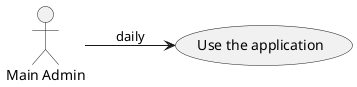
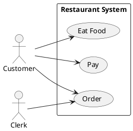
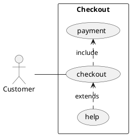
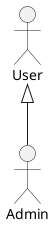
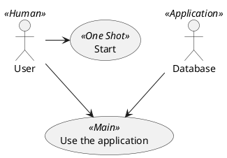

# Use Case Diagram

A use case diagram shows actors (people or external systems) and the features they invoke on the system being designed. It's an overview of functional requirements, useful for aligning stakeholders early in design.

## Core syntax

Two shapes carry the diagram:

- **Use cases** are enclosed in parentheses: `(Login)`. Or use the `usecase` keyword: `usecase Login`.
- **Actors** are enclosed in colons: `:User:`. Or use the `actor` keyword: `actor User`.

Connections use the same arrow syntax as everywhere else: `-->` solid, `..>` dotted. `<|--` denotes extension (inheritance between actors or use cases).

## Minimal example

`left to right direction` is almost always wanted for use case diagrams — the default top-to-bottom layout makes them tall and narrow.

## Aliases

Use `as` to give an alias, especially when the display name has spaces:

## Grouping with packages

`package`, `rectangle`, `frame`, `cloud`, `database`, `folder`, `node` all create grouping boxes. For use case diagrams, `rectangle` (often labeled "System") is the conventional way to mark the system boundary:

## Extension and inclusion

Two specific dotted-arrow relationships are part of standard UML use case diagrams:

- `(Login) <.. (Forgot Password) : extends` — one use case optionally extends another
- `(Checkout) ..> (Pay) : include` — one use case always includes another

The arrow direction follows the UML convention: `extends` points *from* the extending use case *to* the base one; `include` points *from* the base *to* the included one.

## Inheritance between actors

Use `<|--` to show that one actor specializes another:

This says Admin is a kind of User.

## Notes and stereotypes

Notes work as in every diagram: `note right of`, `note left of`, etc.

Stereotypes add a UML-style tag in `<< >>`:

## Actor style

By default, actors are stick figures. Change with `skinparam actorStyle awesome` (filled) or `skinparam actorStyle Hollow` (outline only).

## Common pitfalls

- **Forgetting `left to right direction`.** Most use case diagrams look wrong in the default orientation. Add it almost reflexively.
- **Treating use cases as functions.** They're user-facing capabilities, not internal operations. "Hash password" is not a use case; "Log in" is.
- **Drawing too many.** A use case diagram with thirty use cases stops being useful. Group by package or split into multiple diagrams once it gets crowded.
- **Confusing `extends` and `include` arrow direction.** They go in opposite directions in standard UML, and it's easy to invert them. Re-check before delivering.
