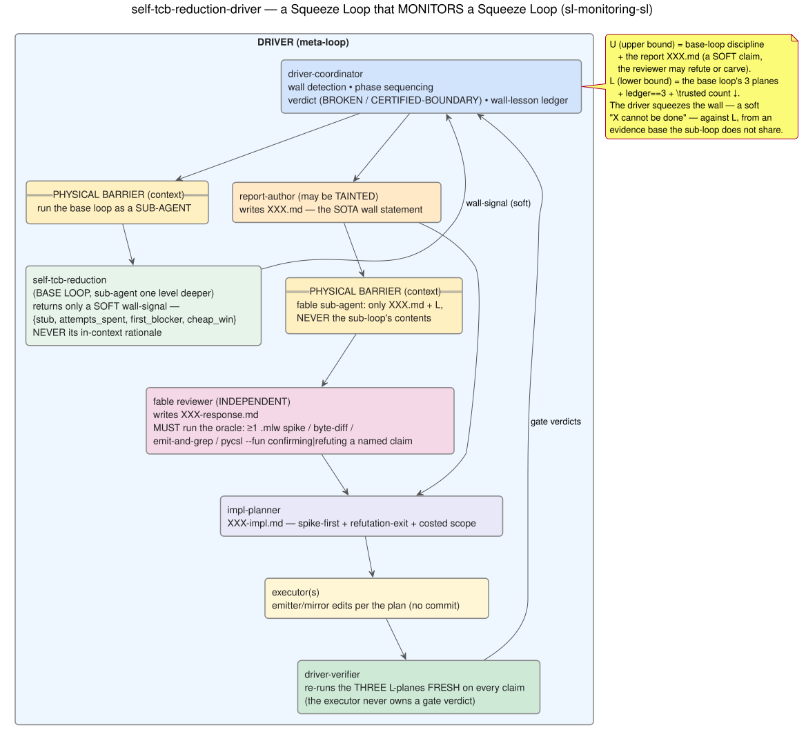
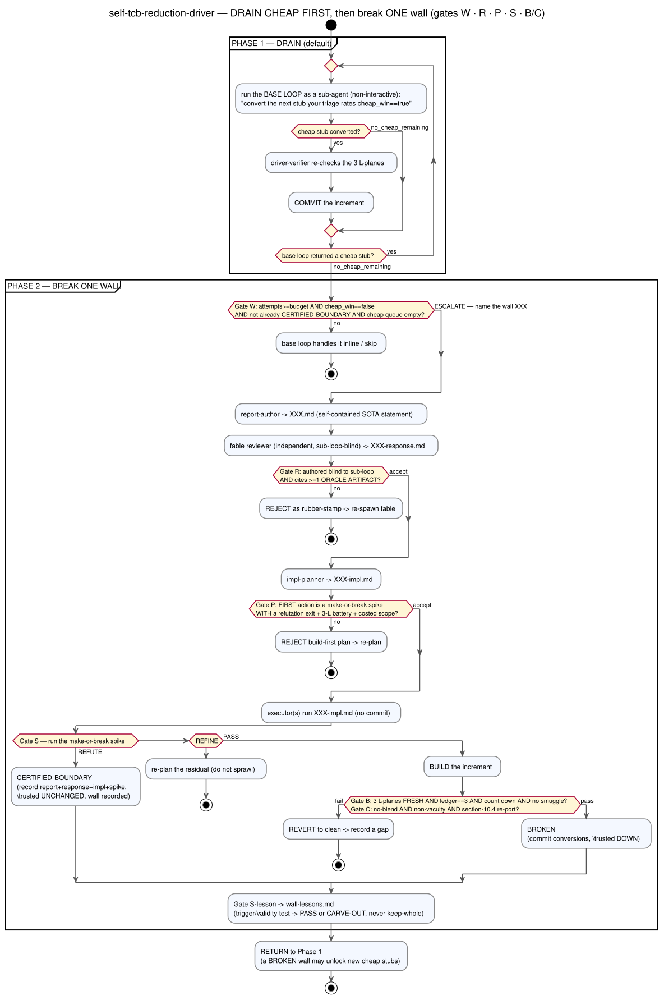

# self-tcb-reduction-driver — a visual guide to the SL that monitors an SL

*An **alternative, diagram-first** rendering of the `self-tcb-reduction-driver` — a Squeeze Loop that
**drives** the [`self-tcb-reduction` base loop](sl-self-tcb-reduction.md). The authoritative sources are the
skill (`config/skills/self-tcb-reduction-driver/SKILL.md`) and its machine-readable config
(`self-tcb-reduction-driver.json`). This page is the shape at a glance.*

---

## The idea: a monitor of a monitor

The base loop converts `\trusted` stubs. Sometimes it gets **stuck** on a stub its recognizers cannot
convert. The driver watches for that and, when the stuck stub is a genuine **wall** (measurement shows it is
*not* a cheap win), runs the **wall-breaking workflow** end-to-end:

> write a self-contained state-of-the-art report → get an **independent** review from a *fable* agent that
> **never sees the sub-loop's contents** → synthesize an implementation plan → execute it **spike-gated**,
> with every agent claim re-verified against the base loop's three `L`-planes.

This is the `sl-monitoring-sl` pattern: the driver *squeezes the wall* — a soft, sub-loop-authored claim
that *"X cannot be done"* — against the base loop's own hard `L`, **from an evidence base the sub-loop's
actors do not share**. The verdict is always one of exactly two, never a third:

- **BROKEN** — a stub behind the wall converts (full gate battery green, `\trusted` count strictly down,
  ledger unchanged); or
- **CERTIFIED-BOUNDARY** — the wall is a genuine limit, *proven* by the plan's make-or-break spike
  **refuting** the build before any emitter edit, recorded with a reproducible reason.

## Structure: nesting and the two physical barriers

The driver's power comes from two **physical** context barriers (not honorary ones): it runs the base loop
as a **sub-agent** (so it never sees the sub-loop's in-context rationale — only a soft `wall-signal`), and
it runs the reviewer as a **fable sub-agent** whose context is *only* the report + the oracle `L` (so the
review's value is a genuinely independent evidence base, not a second opinion on the prose).

| Actor | Builds | Blind to |
|-------|--------|----------|
| **driver-coordinator** | wall detection, phase sequencing, the verdict, the wall-lesson ledger | the base loop's in-context rationale (runs it as a sub-agent) |
| **base loop** (sub-agent) | routine cheap conversions; surfaces a soft `wall-signal` `{stub, attempts_spent, first_blocker, cheap_win}` | — |
| **report-author** (may be *tainted*) | `XXX.md`, the SOTA wall statement | — |
| **fable reviewer** (independent) | `XXX-response.md` — **must run the oracle** (≥1 `.mlw` spike / byte-diff / emit-and-grep / `pycsl --fun`) | **the sub-loop's contents** |
| **impl-planner** | `XXX-impl.md` — spike-first, refutation-exit, costed scope | — |
| **executor(s)** | the emitter/mirror edits (no commit) | the byte-diff baseline; the verdict logic |
| **driver-verifier** | re-runs the three `L`-planes **fresh** on every claim | the executor's recognizer rationale |

## Flow: drain cheap first, then break ONE wall

The default order is **not negotiable**: wall-breaking is expensive (a fable review + spikes + multi-agent
execute) and yields at most one stub, so **every** remaining cheap win is drained **before** any wall is
escalated. The loop is: *drain all cheap → break one wall → drain all cheap again → …*, terminating at floor.

The five gates the flow enforces:

- **Gate W — wall-escalation.** Fires the expensive cycle *only* when `attempts ≥ budget` **AND**
  `cheap_win == false` **AND** the stub is not already a recorded boundary **AND** the cheap queue is empty.
  This is both the cost control and the barrier (the driver decides from the soft `wall-signal`, never by
  reading the sub-loop's work).
- **Gate R — reviewer independence, *with artifact teeth*.** The response is accepted only if it was authored
  blind to the sub-loop **AND** it cites ≥1 independent **oracle artifact** confirming or refuting a *named*
  claim of the report. A prose-only "looks right" review is **rejected as a rubber stamp**.
- **Gate P — impl-plan acceptance.** The plan is accepted **only** if its first action is a make-or-break
  falsifier **spike** with an explicit **refutation exit**. A build-first plan is rejected — this is what
  stops "execute until done" from grinding an impossible wall.
- **Gate S — the spike runs.** `PASS →` build; `REFUTE →` CERTIFIED-BOUNDARY (stop); `REFINE →` re-plan the
  residual. "Cleared" is never asserted without the spike's run.
- **Gate B / C — per built increment.** All three `L`-planes fresh (driver-verifier, not the executor's
  self-report), ledger `== 3`, count strictly down, no plane-blending, non-vacuity, and the §10.4 re-port of
  any verified emitter method edited in the same increment.

## Two modes

- **Interactive** (no duration) — run **one** iteration, present the outcome, stop; the user drives the
  cadence.
- **Autonomous time-boxed** (`"… for 2 hours"`) — iterate walls back-to-back with **no per-iteration
  prompting** until a wall-clock deadline persisted to `getting-better/.driver-deadline` (so it survives
  context summarization). Commit **every** increment; **never** auto-push; stop early if the frontier
  reaches floor. Speed comes from *not prompting*, **never** from skipping a gate.

## The proven instance, and the current frontier

The `_field_type_of` wall is the worked example this loop generalizes (`file-type-of-wall.md` +
`…-response.md` + `…-impl.md`): its S-R2 spike **refuted** the map-`.values()` build → CERTIFIED-BOUNDARY,
demonstrating all four gate verdicts at once.

The 2026-07 autonomous run then escalated the **stmt-walker wall**: an independent fable spike proved it a
**bounded feature** (14/14 Valid on Alt-Ergo + Z3, 0 axioms), the §2 emitter spike pinned the make-or-break
to a single missing `list <T>` parameter family, and a follow-up probe certified that fix **bounded and
byte-inert** — a build deferred with its gap precisely pinned, not a wall ground into the ground. Every such
outcome is banked in `getting-better/wall-lessons.md` through **Gate S-lesson** (trigger/validity test →
PASS or CARVE-OUT, never keep-whole).

---

### Legend

Diagrams are generated from PlantUML sources in [`images/`](images/) (`sl-driver-structure.puml`,
`sl-driver-flow.puml`). Regenerate with `plantuml -tsvg docs/images/*.puml`. Colour convention (shared with
the [base-loop page](sl-self-tcb-reduction.md)): **blue** = upper bound / authored authority, **green** =
lower bound / oracle planes & the base loop, **amber** = coordination, tainted authorship & the physical
barriers, **pink** = the independent reviewer, **lilac** = planning.
