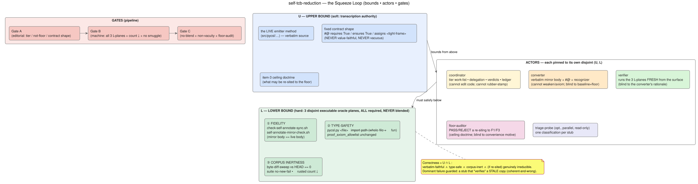
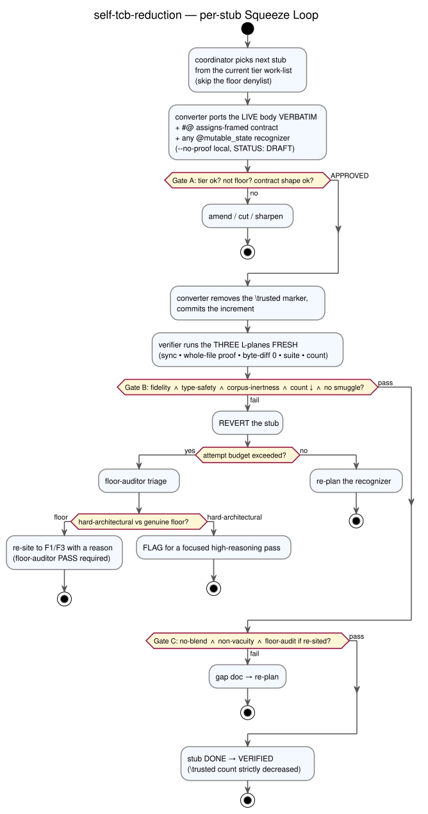

# self-tcb-reduction — a visual guide to the base Squeeze Loop

*An **alternative, diagram-first** rendering of the `self-tcb-reduction` Squeeze Loop (SL). The
authoritative sources remain the skill (`config/skills/self-tcb-reduction/SKILL.md`), its machine-readable
config (`self-tcb-reduction.json`), and the loop procedure/ledger (`self-tcb-reduction.md`). This page is for
readers who want the shape at a glance. Its companion is [the driver loop that monitors this
one](sl-self-tcb-reduction-driver.md).*

---

## What it does, in one sentence

PyCSL verifies a **mirror of its own emitter**: the compiler's WhyML-generation code is itself annotated
Python that PyCSL proves type-safe, frame-correct, and terminating. This loop drives the mirror's
`\trusted`-stub count (assumed contracts) down to its irreducible floor — converting each stub into a
**verified, body-faithful** method, one at a time, each held to three disjoint oracles.

## The Squeeze: bounds, actors, gates

A Squeeze Loop pins work between a **soft upper bound `U`** (the strongest claim any actor may make) and a
**hard lower bound `L`** (executable oracles nothing can argue away). Correctness is exactly the
intersection `U ∩ L`. Each actor is pinned to its *own* disjoint `(U, L)` pair so that no actor can relieve
its own constraint — the dominant *coherent-and-wrong* failure (a stub that "verifies" a **stale** copy) is
caught because the actor that writes a conversion never owns the oracle that accepts it.

| Band | Content |
|------|---------|
| **`U` — upper bound (soft)** | the **live** emitter method (verbatim transcription source) · the fixed contract shape `#@ requires True / ensures True / assigns <tight-frame>` (type-safety + frame only — **never** value-faithful, **never** vacuous) · the item-3 ceiling doctrine bounding what may be re-sited to the floor |
| **`L` — lower bound (hard, 3 planes, never blended)** | ① **fidelity** (`check-self-annotate-sync.sh` ∧ `self-annotate-mirror-check.sh`) · ② **type-safety** (`pycsl.py <file>` whole-file + `--fun`; `proof_axiom_allowlist` unchanged) · ③ **corpus inertness** (`byte-diff-sweep` vs HEAD `== 0`; suite no-new-fail; `\trusted` count strictly ↓) |
| **Gates** | **A** editorial (right tier · not on the floor denylist · contract shape) → **B** machine (all 3 L-planes + count ↓ + nothing smuggled) → **C** coverage (no plane-blending · non-vacuity · floor-audit) |

### The actors and their disjointness

- **coordinator** — tier work-list, delegation, verdicts, the shrinking-count ledger. *Cannot* edit code or
  rubber-stamp.
- **converter** — ports the live body verbatim + the `#@` frame + any `@mutable_state`-gated recognizer.
  *Blind to* the byte-diff baseline and the floor-auditor's reasoning.
- **verifier** — runs the three `L`-planes **fresh from the surface only**. *Blind to* the converter's
  recognizer rationale.
- **floor-auditor** — a PASS/REJECT verdict on every re-siting of a stub to the floor (F1/F3), holding the
  ceiling doctrine as its `U`. *Blind to* the converter's convenience motive.
- **triage-probe** (optional, the only safely-parallel actor) — one read-only classification per stub.

## The per-stub loop

Every stub travels the same pipeline; a failure at any gate **reverts** and either re-plans (budget
remaining) or escalates to the floor-auditor (budget exceeded). "Done" is *gate-defined*, never
self-declared.

## Where it is now (2026-07)

The T1–T4 conversion backlog is **closed** (campaign at count ~1226); the certified IR-node ADT foundation
is banked with the **3-axiom Rocq/Lean ledger held**. The live frontier is **not** a conversion backlog —
it is dominated by a semantic ceiling and soundly-trusted boundaries. Per its standing rule the loop
**measures before it builds** (a whole-body `--fun` census, never a `--no-proof` typecheck) and, on
invocation, **asks the user** which move to make rather than auto-running.

When the loop hits a stub it *cannot* convert with its recognizers and that measurement shows is **not a
cheap win**, that stub is a **wall** — and a second loop takes over to break it. See
[**self-tcb-reduction-driver**](sl-self-tcb-reduction-driver.md).

---

### Legend

The diagrams are generated from PlantUML sources in [`images/`](images/) (`sl-base-structure.puml`,
`sl-base-loop.puml`). Regenerate with `plantuml -tsvg docs/images/*.puml`. Colour convention across both
pages: **blue** = upper bound / authored authority, **green** = lower bound / oracle planes, **amber** =
coordination & tainted-authorship, **pink/red** = gates & the independent reviewer, **lilac** = planning.
